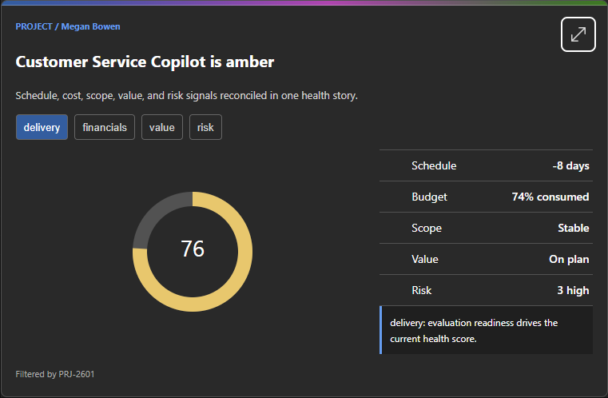
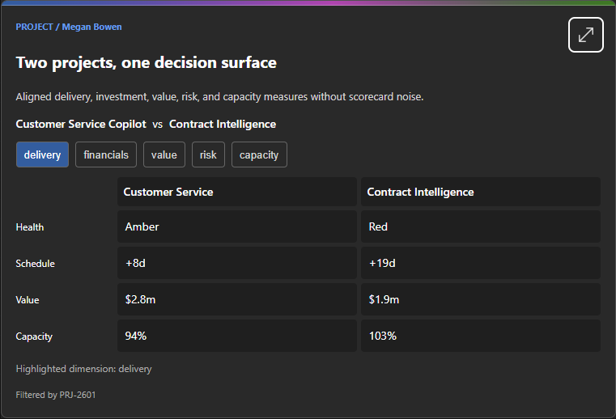
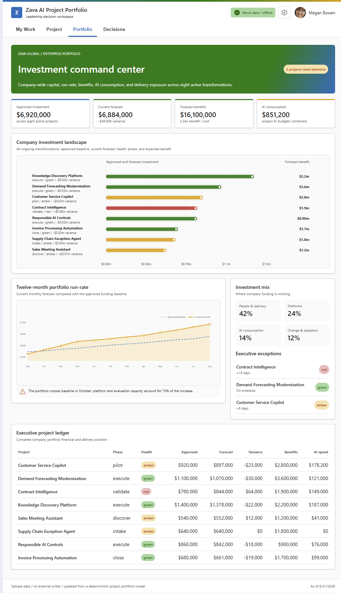
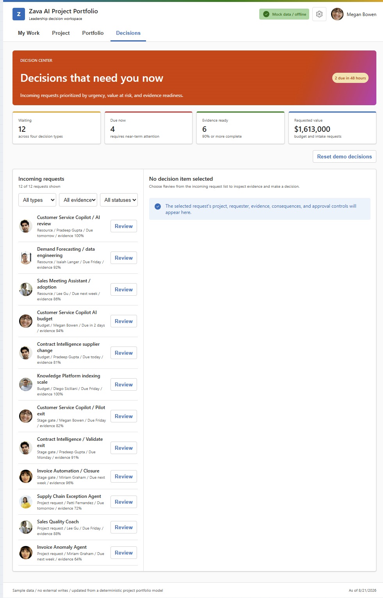

# Project Portfolio

**Intent-driven Project & Portfolio management experiences for Microsoft 365 Copilot**

## Summary

Project Portfolio demonstrates intent-driven UX inside Microsoft Copilot. Thirty independently routed operational Copilot Components answer personal delivery, project, portfolio, AI investment, capacity, submission, and approval intents. A catalog-driven capability explorer helps users discover them.

Inline dynamic UX is the primary experience: a project-health question renders evidence, a comparison renders aligned trade-offs, and a request renders an editable review flow. Operational components can expand into a shared full-screen workspace with **My Work**, **Project**, **Portfolio**, and **Decisions** dashboards. All data and confirmed actions are deterministic, offline, and sample-only.

For a live presentation, use the timed [3-minute dynamic UX demo](Zava-Project-Tracker-3-Minute-Demo.md). For routing, extraction, and UX testing, use the complete [31-component prompt catalog](Zava-Project-Tracker-Demo-Prompts.md).

> This repository is a rebranded and improved derivation of the excellent [Zava Project Tracker](https://github.com/pnp/spfx-copilot-components/tree/main/samples/zava-project-tracker) sample from the Microsoft 365 & Power Platform Community (PnP).

## Screenshots









## Used SharePoint Framework Version


This sample targets the SPFx `1.24.0-beta.2` Copilot Component preview. Confirm the supported SPFx Copilot component version in your target tenant before production adoption.

## Applies to

- [SharePoint Framework](https://aka.ms/spfx)
- [Microsoft 365 tenant](https://docs.microsoft.com/sharepoint/dev/spfx/set-up-your-developer-tenant)

> Get your own free development tenant by subscribing to the [Microsoft 365 developer program](http://aka.ms/o365devprogram).

## Prerequisites

- Node.js `>=22.14.0 <23.0.0` for local development.
- A SharePoint app catalog and Microsoft Copilot access for deployment and tenant-host validation.
- No external API, Azure resource, or runtime network dependency is required for the sample data.
- For local Workbench testing, replace `{tenantDomain}` in `config/serve.json` with the target tenant domain.

## Configuration

See **[CONFIGURATION.md](CONFIGURATION.md)** for a full inventory of package, solution, agent, serve, and validation configuration files.

## Solution

| Solution | Author(s) |
| --- | --- |
| `project-portfolio` | Rebranded from Microsoft 365 & Power Platform Community (PnP) Zava Project Tracker sample |

## Version history

| Version | Date | Comments |
| --- | --- | --- |
| 0.1.0 | September 2026 | Rebranded to Project Portfolio; added CONFIGURATION.md |
| 1.0 | August 20, 2026 | Upstream public sample baseline with 31 Copilot Components |

## Disclaimer

**THIS CODE IS PROVIDED _AS IS_ WITHOUT WARRANTY OF ANY KIND, EITHER EXPRESS OR IMPLIED, INCLUDING ANY IMPLIED WARRANTIES OF FITNESS FOR A PARTICULAR PURPOSE, MERCHANTABILITY, OR NON-INFRINGEMENT.**

---

## Minimal Path to Awesome

```bash
npm install
npm run build
```

For local development, configure the tenant domain in `config/serve.json`, then run:

```bash
npm start
```

Add the generated **Project Portfolio** agent to Microsoft Copilot and start with one of the conversation starters. Use the prompt catalog for deterministic routing checks.

### Video: test the package in Microsoft 365

[](https://www.youtube.com/watch?v=4asOZi4PNUQ)

[Watch on YouTube](https://www.youtube.com/watch?v=4asOZi4PNUQ)

Build from source and complete your own tenant, accessibility, privacy, localization, and security validation before production use.

Other build commands can be listed using `heft --help`.

## Features

- 30 purpose-designed operational Copilot Components and one capability explorer.
- Information, review/decision, and request/submit operation models.
- Shared responsive full-screen shell with four useful default dashboards.
- Explicit Draft → Review → Confirm → session receipt workflows.
- Typed invocation versioning and supported inline-to-full-screen context continuation.
- Deterministic mock project/portfolio data, bundled personas, and no external writes.
- Fluent UI v9, React 17, Griffel owner-document styling, and focused D3 visualizations.
- Tenant-free UX review harness with responsive, dark, reduced-motion, and zoom evidence.
- Optimized shared production bundle with generated plugin and package-output validation.

## Data and safety

- Projects, people, financials, capacity, AI usage, risks, and approvals are deterministic mock data.
- Named people are standard fictional Microsoft 365 demo personas.
- Prompt values prefill or filter UX but never submit, approve, reject, assign, or write automatically.
- Confirmed sample actions persist only in browser-session state and can be reset from Decisions.
- No live Graph, SharePoint, Planner, Project, Fabric, finance, or AI-service call is made at runtime.

## Accessibility and responsive design

- Keyboard-accessible tabs, forms, queues, controls, and icon-button names.
- Visible text/icon semantics accompany status colors.
- Reduced-motion behavior and real 200% browser zoom validated in the tenant-free review harness.
- Inline layouts validated at 340 px and 760 px; full-screen dashboards validated from 340 px through keynote width in light and dark themes.
- Charts provide accessible names and nearby textual insight. Additional table/list equivalents and authenticated-host screen-reader/high-contrast validation remain tracked in [todo.md](todo.md).

## Worldwide readiness

- Currency display supports USD, EUR, and JPY in the full-screen session settings.
- Layouts are designed for narrow and wide hosts without viewport-scaled typography.
- Authored UI and localization resources are currently English (US). Full translation, right-to-left presentation, locale-specific week starts, and final worldwide stress testing are documented follow-ups.

## Validation status

- `168/168` tests pass with zero build warnings (upstream).
- All 31 manifests, tools, schemas, registrations, and optional prompt properties validate.
- The generated API plugin and final `.sppkg` pass automated output audits.
- All 39 unified-gallery screenshots are validated against `assets/sample.json`.

## Demo and testing

- [3-minute dynamic UX demo](Zava-Project-Tracker-3-Minute-Demo.md)
- [10-minute business value demo](Zava-Project-Tracker-10-Minute-Business-Demo.md)
- [5-minute developer and architecture demo](Zava-Project-Tracker-5-Minute-Technical-Demo.md)
- [31-component demo prompt catalog](Zava-Project-Tracker-Demo-Prompts.md)
- [Unified sample gallery metadata](assets/sample.json)
- [Experience and implementation plan](todo.md)
- [Reusable agentic creation rules](agentic-creation-rules.md)
- [Configuration reference](CONFIGURATION.md)

## Attribution

Original sample: **Zava Project Tracker / Zava AI Project Portfolio Agent**  
Authors: Microsoft 365 & Power Platform Community (PnP)  
Source: https://github.com/pnp/spfx-copilot-components/tree/main/samples/zava-project-tracker

This repository rebrands and organizes that work for easier adoption as a generic Project Portfolio agent. All credit for the architecture, components, tests, and demo design belongs to the original authors.

## References

- [Getting started with SharePoint Framework](https://docs.microsoft.com/sharepoint/dev/spfx/set-up-your-developer-tenant)
- [Building for Microsoft Teams](https://docs.microsoft.com/sharepoint/dev/spfx/build-for-teams-overview)
- [Use Microsoft Graph in your solution](https://docs.microsoft.com/sharepoint/dev/spfx/web-parts/get-started/using-microsoft-graph-apis)
- [Publish SharePoint Framework applications to the Marketplace](https://docs.microsoft.com/sharepoint/dev/spfx/publish-to-marketplace-overview)
- [Microsoft 365 Patterns and Practices](https://aka.ms/m365pnp)
- [Heft Documentation](https://heft.rushstack.io/)

---

**Sharing is caring.**
